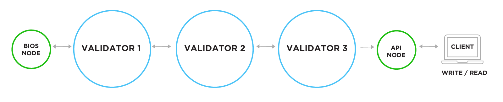

# Running a V12 Compute Node

<p align="center">
  

</p>

<center>

[](https://standardjs.com)   

</center>

## About This Project

This project contains fully automated scripts, which will build and launch a new V12 blockchain on your personal computer.  Your shiney new V12 blockchain will automatically spin up all required V12 compute nodes, so that you can begin developing writing code to help move the V12 blockchain forward.  Once you build and run your new V12 blockchain each of the V12 compute nodes will take turns producing new blocks and processing any transactions you send to it.  Because, each V12 compute node is doing the work of securing your new V12 blockchain, and transmitting and clearing V12 transactions, each of its compute nodes will receive a `"block reward"`, which means newly minted V12 tokens will be earned in exchange for the work performed by each of the V12 compute nodes.   

A V12 blockchain running on your personal computer can be useful if you would like to contribute to the V12 project by writing code, fixing bugs, or testing the software.  Every little bit helps and is greatly appreciated.

The following is a diagram of the four V12 compute nodes, which are launched when this project is built and run.  Each V12 compute node is contained withing a `"sandbox"` environment, also referred to as a `"container"`, which it cannot break out of.  This is done to protect your shiney new V12 blockchain, and also your personal computer and personal files, from potential cyber attack by the outside world.



At a future date, this project will also be used to build, install, and run a V12 compute node on what we refer to as the `"mainnet"`, which means the one and only V12 blockchain running live on the internet 24x7.  By running a V12 `"mainnet"` compute node, you can earn new V12 crypto in exchange for running a V12 compute node.  When you run a V12 compute node, your V12 compute node takes turns processing transactions and securing the V12 blockchain, which is why you are given new V12 tokens, in exchange for your work in helping us move this project forward.

The only way to earn V12 tokens is through your work of setting up and securing a V12 compute node.  Which is the same exact way Bitcoin miners earn new Bitcoin, by doing work.  Real, measurable, meaningful work.  Work is what backs Bitcoin.  And work is what backs V12.  So, when anyone tells you Bitcoin or V12 is backed by "nothing", you can share your knoweldge with them to enlighten them on what it is eactly gives both Bitcoin and V12 value, which is your work.  The same exact way as when a farmer grows crops, it's always work that adds value to the world.

## Installation

This project builds and runs a new V12 blockchain beginning with its `genesis` block.  It can be used to provision all V12 computer nodes required to develop on the V12 blockchain.

1. Clone this repo: `git clone --depth=1 https://github.com/Vet-The-Vote/genesis-nodes v12-genesis-nodes`
2. Change to the newly created directory: `cd v12-genesis-nodes`

### Software Dependencies

In order to build and run a V12 genesis node you will need the following software installed.

- [docker](https://www.docker.com/)
- [docker-compose](https://docs.docker.com/compose/)

### Building the V12 Computer Node

To build the V12 compute node execute:

```shell script
export VERSION_NUMBER=0.9.1.beta
VERSION_NUMBER=0.9.1.beta docker-compose build
```

### Prerequisite 1: Create a Docker Swarm

This project launches four V12 compute nodes, which communicate with each other to create a brand new V12 blockchain, which will run on your personal computer.  In order for the V12 compute nodes to communicate with each other, they must be created inside a virtual environment, which has its own private network.  Docker Swarm is the tool we use to create the virtual environment with its own private network.  Docker Swarm was installed as a part of Docker, so you do not need to install it seperately.  But, before we can use Docker Swarm, we must "initialize" it.  To initialize a Docker Swarm execute the following on the command line:

```shell
docker swarm init
```

For more information on how to use Docker Swarm, see the [official documentation](https://docs.docker.com/engine/swarm/).

### Prerequisite 2: Create private keys

* [ ] **TODO:** add instructions on how to create a new V12 private key

### Prerequisite 3: Add private keys

In order to run a V12 compute node (aka a "validator" node) you must add a private key, which it can use to sign new blocks.  One private key is required for each V12 compute node.  Because, this project will launch four V12 compute nodes, four private keys are required one for each compute node.  You must run the following four commands, one for each of the four private keys.  Before running the commands, please replace the words `V12_PRIVATE_KEY` with one of the V12 private keys you created in the previous step of these installation instructions.

```shell script
echo "V12_PRIVATE_KEY" | docker secret create V12_LOCALHOST_BIOS_PRIVATE_KEY -
echo "V12_PRIVATE_KEY" | docker secret create V12_LOCALHOST_VALIDATOR1_PRIVATE_KEY -
echo "V12_PRIVATE_KEY" | docker secret create V12_LOCALHOST_VALIDATOR2_PRIVATE_KEY - 
echo "V12_PRIVATE_KEY" | docker secret create V12_LOCALHOST_VALIDATOR3_PRIVATE_KEY - 
```

## Running the V12 Compute Nodes

Now that you have created new Docker Swarm, private keys, and made the private keys accessible to the V12 compute nodes we are now ready to launch your very own V12 blockchain.  To do so, execute the following on the command line:

```shell
VERSION_NUMBER=0.9.1.beta docker stack deploy -c stack.localhost.yaml v12
```

## License

GNU GPLv3 © 2025 Michael Ellertson

This program is free software: you can redistribute it and/or modify
it under the terms of the GNU General Public License as published by
the Free Software Foundation, either version 3 of the License, or
(at your option) any later version.

This program is distributed in the hope that it will be useful,
but WITHOUT ANY WARRANTY; without even the implied warranty of
MERCHANTABILITY or FITNESS FOR A PARTICULAR PURPOSE.  See the
GNU General Public License for more details.

You should have received a copy of the GNU General Public License
along with this program.  If not, see <https://www.gnu.org/licenses/>.

